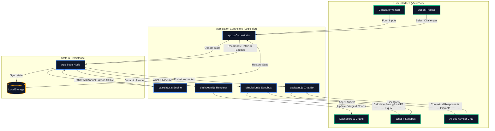

# EcoTrace: Carbon Footprint Awareness Platform

EcoTrace is a premium, high-fidelity, and zero-dependency web application designed to help individuals understand, track, simulate, and reduce their carbon footprint. Utilizing a modern dark glassmorphic design and real-world environmental calculations, it provides immediate awareness and actionable paths to net-zero living.

🔗 **GitHub Repository**: [https://github.com/Rubini-0729/carbon-footprint-platform](https://github.com/Rubini-0729/carbon-footprint-platform)

## 📊 System Architecture & Data Flow

Below is the conceptual architecture and reactive data flow of the EcoTrace Platform:



---

## 🌍 1. Chosen Vertical: "Urban Household & Smart Commuter"

EcoTrace focuses on the lifestyle decisions of **urban individuals**. Urban dwellers typically have distinct carbon profiles dominated by:
1. **Housing Energy**: grid electricity consumption, natural gas heating, and the potential of green power tariffs or solar energy.
2. **Mobility and Commutes**: daily driving mileage, public transportation (buses, metro, trains), and high-impact long-distance flights.
3. **Habits & Consumption**: dietary supply chains (especially the methane and land impact of meat and dairy consumption) and household municipal solid waste management (recycling vs. landfilling).

---

## 🛠️ 2. Core Features

### 📊 Dynamic Dashboard & Benchmarking
- **SVG Progress Ring**: A clean visual gauge that measures the user's total annual footprint against a target scale of **20 tonnes CO₂e**.
- **Real-Time Relative Chart**: Dynamic CSS-height vertical bars showing the relative contribution of Housing, Travel, and Diet/Waste next to their combined total.
- **Regional Benchmarks**: Live text analysis comparing the user's footprint against the US average (16.0 t), Global average (4.7 t), and the Net-Zero 2050 target (< 2.0 t).

### 📝 Stepped Calculator Wizard
- **Sectioned Input Forms**: Smooth stepped navigation (Housing → Transportation → Diet & Waste) preventing form-fatigue.
- **Instant Calculation**: Reactive JavaScript updating that recalculates emissions immediately on keypress/change.
- **LocalStorage Persistence**: Auto-saves user inputs so their carbon profile is restored upon returning or refreshing the page.

### 🎛️ What-If Simulation Sandbox
- **Reduction Sliders**: Adjust clean energy shares, public transit replacements, meatless days, and home efficiency insulation.
- **Side-by-Side Comparison**: Visually compares "Current Profile" against "Simulated Profile" to show avoided carbon in real-time.
- **Financial Savings Estimate**: Computes annual monetary savings ($) from reduced grid electricity, heating gas, and automobile fuel costs.
- **EPA Equivalences**: Translates abstract carbon tonnes into tangible analogies:
  - Tree seedlings grown for 10 years (1 tonne ~ 45 seedlings).
  - Gasoline passenger vehicles removed from roads for 1 year (1 car ~ 4.6 tonnes).
  - Smartphones charged and powered (1 charge ~ 8.3 grams).

### 🤖 Custom Logic-based AI Eco-Advisor
- **Contextual Suggested Prompts**: Generates suggestion chips triggered by the user's highest emission hot-spot (e.g., if driving emissions represent >40% of their footprint, it prioritizes transit and EV advice).
- **Rule-based Response Tree**: Uses a robust query parser to respond with customized metrics based on their actual inputs (e.g., calculating the precise CO₂e saved if they switch their specific electricity usage to solar).

### 🏆 Action Tracker & Gamification
- **Checklist Challenges**: User-committable goals like "Meatless Mondays" or "Smart Thermostats" that temporarily adjust dashboard totals.
- **Unlockable Achievements**: Earn badge rewards (🌱 Eco Starter, 🌿 Green Advocate, 🏅 Climate Hero) based on the number of completed challenges.

---

## 📐 3. Approach & Calculation Methodology

Emissions are calculated in **tonnes of CO₂ equivalent (t CO₂e)** per year based on standard emission factors aligned with the **Greenhouse Gas (GHG) Protocol**:

### A. Housing Energy
$$\text{Annual Electricity Emissions (t)} = (\text{Electricity (kWh/mo)} \times 12) \times 0.000385 \times \left(1 - \frac{\text{Clean Share (\%)}}{100}\right)$$
$$\text{Annual Natural Gas Emissions (t)} = (\text{Gas (kWh/mo)} \times 12) \times 0.000185$$

### B. Transportation & Commuting
- **Car Travel**: Annual mileage is multiplied by the vehicle engine type's specific emission factor:
  - **Petrol/Gasoline**: $0.00018 \text{ t/km}$
  - **Diesel**: $0.00017 \text{ t/km}$
  - **Hybrid**: $0.00010 \text{ t/km}$
  - **Electric (EV)**: $0.00005 \text{ t/km} \times \left(1 - \frac{\text{Clean Share (\%)}}{100}\right)$ (charged from household grid)
- **Public Transit**: $(\text{Weekly transit km} \times 52) \times 0.00004 \text{ t/km}$
- **Flights**: $\text{Annual flight hours} \times 0.090 \text{ t/hour}$

### C. Consumption & Waste
- **Diet Footprint** (Flat annual factors):
  - *Heavy Meat Eater*: $2.5 \text{ t/yr}$
  - *Medium Meat Eater*: $1.7 \text{ t/yr}$
  - *Low Meat / Flexitarian*: $1.2 \text{ t/yr}$
  - *Vegetarian*: $0.9 \text{ t/yr}$
  - *Vegan*: $0.6 \text{ t/yr}$
- **Recycling & Waste Footprint**:
  - *No recycling*: $0.5 \text{ t/yr}$
  - *Partial recycling*: $0.3 \text{ t/yr}$
  - *Full recycling/composting*: $0.1 \text{ t/yr}$

---

## 📝 4. Key Assumptions Made

1. **Electricity Grid Intensity**: Set to **0.385 kg CO₂/kWh**, which represents a global average grid composition containing mixed fossil and clean sources.
2. **Flight Radiative Forcing**: The emission factor of **90 kg CO₂/hour** includes the radiative forcing multiplier (high-altitude release of nitrogen oxides and water vapor, magnifying greenhouse impacts).
3. **Financial Saving Rates**:
   - Electricity cost: **$0.16 / kWh**
   - Natural Gas cost: **$0.08 / kWh**
   - Petrol cost: **$1.45 / liter** (assuming an average consumption of 7.5 liters/100km).
   - Public transit fare offset: **$0.05 / km** transit cost.
4. **EPA Environmental Equivalences**:
   - A tree seedling absorbs **22 kg CO₂/year** (or **220 kg** over 10 years).
   - An average passenger car emits **4.6 tonnes CO₂e/year** (assuming ~22,000 km driven annually).
   - A smartphone charge draws **~0.01 kWh**, emitting **8.22 grams** of carbon from an average grid.

---

## 🚀 5. How to Run & Test

### 💻 Run Locally
Since the application is built using Vanilla HTML, CSS, and JS, there is no build step or package dependencies.
1. Make sure you have [Node.js](https://nodejs.org) installed.
2. Run the local development server:
   ```bash
   npm start
   ```
   *Alternatively, if node is not installed, you can simply double-click and open `index.html` in any web browser.*
3. Open `http://localhost:3000` (or the address printed by `serve`) in your browser.

### 🧪 Run Calculations Verification Test
To run the mathematical test suite checking the carbon equations:
```bash
npm test
```
*Alternatively:*
```bash
node js/test_calc.js
```
This runs the unit test suite inside Node.js, printing outputs and asserting calculations.
